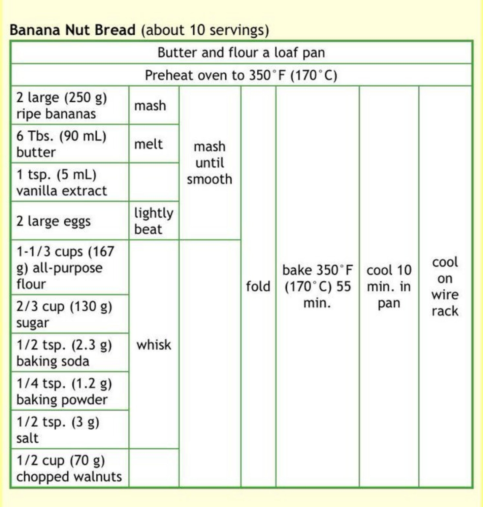

# Recipeak

Recipeak is a mobile-first recipe application built around visual workflow charts instead of paragraph-style recipes.

Each recipe is modeled as a structured chart:

- preparation steps appear above the grid
- ingredients and actions are placed into lettered columns
- numbered rows provide shared vertical alignment across the chart
- vertical merges allow one action to span multiple rows

The project currently defines the product and data model direction:

- [system-design.md](./system-design.md) describes the high-level product and architecture
- [dsl-spec.md](./dsl-spec.md) defines the text DSL, validation rules, and internal document model
- [tech-stack.md](./tech-stack.md) defines the implementation stack for version 1

## Example

The chart below shows the target reading experience the DSL is intended to describe:

